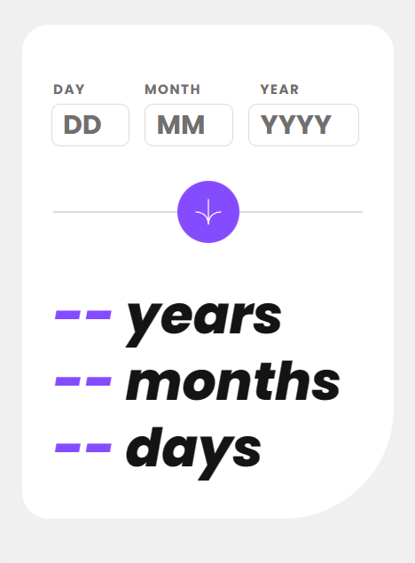

# Frontend Mentor - Age calculator app solution

This is a solution to the [Age calculator app challenge on Frontend Mentor](https://www.frontendmentor.io/challenges/age-calculator-app-dF9DFFpj-Q). Frontend Mentor challenges help you improve your coding skills by building realistic projects. 

## Table of contents

- [Overview](#overview)
  - [The challenge](#the-challenge)
  - [Screenshot](#screenshot)
  - [Links](#links)
- [My process](#my-process)
  - [Built with](#built-with)
  - [What I learned](#what-i-learned)
  - [Continued development](#continued-development)
  - [Useful resources](#useful-resources)
- [Author](#author)
- [Acknowledgments](#acknowledgments)


## Overview

### The challenge

Users should be able to:

- View an age in years, months, and days after submitting a valid date through the form
- Receive validation errors if:
  - Any field is empty when the form is submitted
  - The day number is not between 1-31
  - The month number is not between 1-12
  - The year is in the future
  - The date is invalid e.g. 31/04/1991 (there are 30 days in April)
- View the optimal layout for the interface depending on their device's screen size
- See hover and focus states for all interactive elements on the page

### Screenshot




### Links

- Solution URL: [Add solution URL here](https://your-solution-url.com)
- Live Site URL: [Add live site URL here](https://your-live-site-url.com)

## My process

### Built with

- Semantic HTML5 markup
- CSS custom properties
- Taiwind CSS
- JavaScript
- Mobile-first workflow

### What I learned


Building an age calculator app is a great way to get hands-on experience with web development. 

-HTML and Forms:

Learned how to create forms in HTML and also about input types, such as date, number.

-JavaScript:

Learned about the Date object for date calculations.
```js
    const currentDate = new Date();

    const years = Math.floor(timeDifference / (365.25 * 24 * 60 * 60 * 1000));

    const months = Math.floor((timeDifference % (365.25 * 24 * 60 * 60 * 1000)) / (30.44 * 24 * 60 * 60 * 1000));

    const days = Math.floor((timeDifference % (30.44 * 24 * 60 * 60 * 1000)) / (24 * 60 * 60 * 1000));

```
### Continued development

Want to learn more on javaScript functions .
Also want to learn countup function to animate the numbers.
### Useful resources

- ChatGPT
- Codepen


## Author

- Frontend Mentor - [@manjubhaskar02](https://www.frontendmentor.io/profile/manjubhaskar02)

## Acknowledgments

I always want to thank my husband Safaldas and my mentor Sneha.